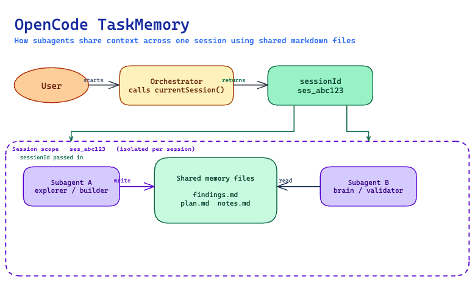

# @cdgmx/opencode-taskmemory

Session-scoped markdown file storage plugin for [OpenCode](https://opencode.ai) agents — add the package name to `opencode.json` and all six tools are available immediately.



---

## What this package provides

| | |
|---|---|
| **Root package** | A ready-to-load OpenCode plugin — register in `opencode.json` and the six tools are available immediately |
| **Six tools** | `taskMemory_currentSession`, `taskMemory_write`, `taskMemory_append`, `taskMemory_read`, `taskMemory_list`, `taskMemory_deleteMemory` |

---

## Plugin usage

### Step 1 — Install

```bash
npm install @cdgmx/opencode-taskmemory
```

### Step 2 — Register in `opencode.json`

```json
{
  "plugin": ["@cdgmx/opencode-taskmemory"]
}
```

OpenCode loads the package as a plugin at startup. All six `taskMemory_*` tools become available to agents immediately — no wrapper file required.

---

## Exported API

### Root package (`@cdgmx/opencode-taskmemory`)

| Export | Description |
|---|---|
| `TaskMemoryPlugin` | Named `Plugin` function — the OpenCode plugin entry |
| `default` | Default alias of `TaskMemoryPlugin` |

### Tool descriptions

| Tool | Description |
|---|---|
| `taskMemory_currentSession` | Return current session ID and memory directory |
| `taskMemory_write` | Write a new markdown memory file (fails if exists unless `overwrite: true`) |
| `taskMemory_append` | Append to a memory file (creates if missing) |
| `taskMemory_read` | Read a memory file |
| `taskMemory_list` | List `.md` memory files in a session |
| `taskMemory_deleteMemory` | Delete a memory file |

---

## Storage root

Files are stored at `<root>/<sessionId>/<name>.md`. The plugin resolves the root automatically:

1. `OPENCODE_TASKMEMORY_ROOT` environment variable
2. Default: `os.tmpdir()/opencode/task/memory`

Session IDs must match the `ses_` prefix pattern returned by OpenCode's runtime context.

---

## Local dogfooding

Repo-local dogfooding can point the `plugin` entry in `opencode.json` directly at `src/index.ts` using a `file://` URL. This is **not public API** and is only valid for local development inside this repository.

---

## Development

```bash
npm ci
npm run build
npm test
npm run pack:check
```

## Release

- Add a changeset with `npm run changeset`
- Merge PR to `main`
- Changesets opens a release PR
- Merge release PR to publish
